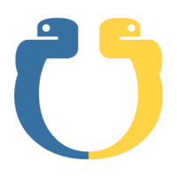

<!-- Based on the Best-README-Template:
https://github.com/othneildrew/Best-README-Template/blob/master/README.md -->

<!-- PROJECT LOGO -->
<br />
<p align="center">
  
<p>
<h2 align="center">Amphivena</h2>


<!-- TABLE OF CONTENTS -->
<details open="open">
  <summary>Table of Contents</summary>
  <ol>
    <li>
      <a href="#about-the-project">About The Project</a>
      <ul>
        <li><a href="#os-support">OS Support</a></li>
        <li><a href="#built-with">Built With</a></li>
      </ul>
    </li>
    <li>
      <a href="#getting-started">Getting Started</a>
      <ul>
        <li><a href="#prerequisites">Prerequisites</a></li>
        <li><a href="#installation">Installation</a></li>
      </ul>
    </li>
    <li><a href="#usage">Usage</a></li>
    <li><a href="#license">License</a></li>
  </ol>
</details>


<!-- ABOUT THE PROJECT -->
## About The Project
Amphivena is a Python-based MitM tool for exercising packet manipulation with byte-level precision. MitM scenarios can be configured and executed repeatedly through the use of JSON 'playbooks'.


### OS Support
Amphivena has been built and primarily tested on [Kali](https://www.kali.org/) however it should be compatible with other Debian-based distributions.    
**!WARNING!** Due to the use of [NetfilterQueue](https://github.com/kti/python-netfilterqueue) Amphivena is entirely incompatible with Windows at this time.


### Built With
Primary packages used by Amphivena:
* [Scapy](https://github.com/secdev/scapy) - packet processing capabilities
* [NetfilterQueue](https://github.com/kti/python-netfilterqueue) - kernel-level packet capture and forwarding


<!-- GETTING STARTED -->
## Getting Started

The following are quick steps to get Amphivena running.

### Prerequisites
```
Python >= 3.9
```

### Installation
1. Clone the repo
```
git clone https://github.com/ajmassi/Amphivena.git
```
2. Install environment dependencies
```
apt install python-dev python3-pip build-essential libnetfilter-queue
```
3. Configure virtual environment
```
cd Amphivena
python3 -m venv .venv
```
4. Activate the virtual environment
```
source .venv/bin/activate
```
5. Install NetfilterQueue
```
pip install cython

git clone git@github.com:kti/python-netfilterqueue.git

cd python-netfilterqueue
rm netfilterqueue.c

python3 setup.py install
```


<!-- USAGE EXAMPLES -->
## Usage
Due to NetfilterQueue hooking in to the kernel packet filter, Amphivena requires root-level permissions to execute.
1. Engage root
```
sudo su
```
2. Re-activate the virtual environment
```
source .venv/bin/activate
```
3. Start the UI! (documentation to come)
```
python amphivena
```


<!-- LICENSE -->
## License

See `LICENSE` for more information.
